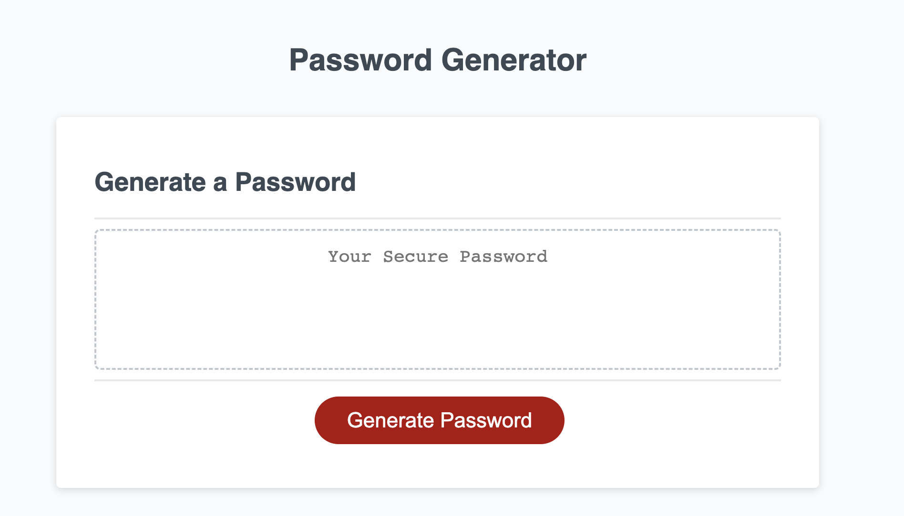

# Password Generator

## Description

This web page helps you generate a random password based on characters that you provides in response to prompts from the page. You may choose lower-case letters, upper-case letters, numerical characters, or special characters.

## Usage

When click "Generate Password" button. A series of questions will prompt you to answer. Remember the length of the password need to have between 8 and 128.  

The four prompts question will ask you for:

1. lower-case letters
2. UPPER-CASE LETTERS
3. Numerical characters
4. Special characters

On each prompt, they are instructed to click "OK" for yes and "Cancel" for no. 

At the end of all the questions it will finally ask you to confirm is that what you want.

Link to application: (https://sonjdaniel.github.io/Challenge-03/)

## Credits
With the help of instruction and guidance of the staff of the UofM coding boot camp, nor without the resources at W3 and the Mozilla Developers Network. I was able to write the code the best I can.